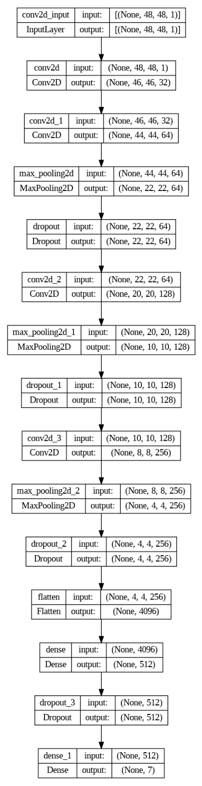
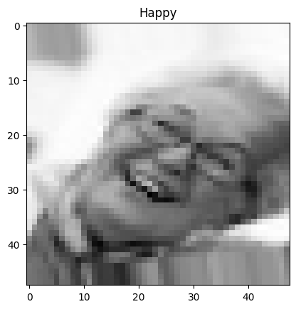
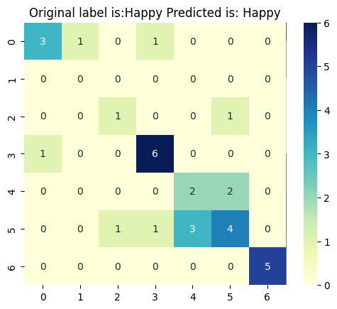
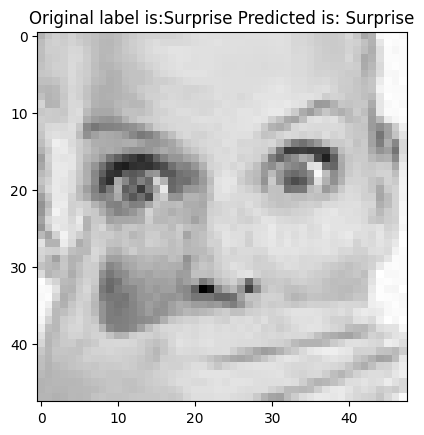
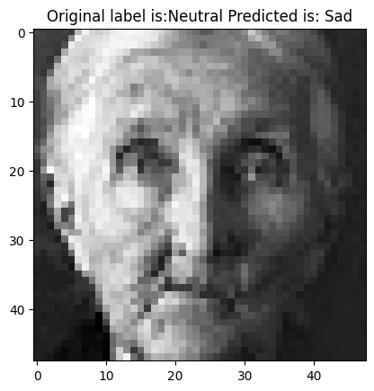

## Emotion Detection with Facial Expression Recognition

This project focuses on building a deep learning model for facial emotion detection using the FER-2013 dataset. The model classifies facial expressions into seven different emotions: Angry, Disgust, Fear, Happy, Neutral, Sad, and Surprise.

## Dataset
The dataset used for this project is the FER-2013 dataset available on Kaggle. It contains a large collection of grayscale facial images, each labeled with one of the seven emotion categories.

The data consists of 48x48 pixel grayscale images of faces. The faces have been automatically registered so that the face is more or less centred and occupies about the same amount of space in each image.

The task is to categorize each face based on the emotion shown in the facial expression into one of seven categories (0=Angry, 1=Disgust, 2=Fear, 3=Happy, 4=Sad, 5=Surprise, 6=Neutral). The training set consists of 28,709 examples and the public test set consists of 3,589 examples.


https://www.kaggle.com/datasets/msambare/fer2013

## Installation
To run this project locally, follow these steps:

1. Clone the repository to your local machine:
```
git clone https://github.com/yourusername/emotion-detection.git
```
2. Navigate to the project directory:
```
cd emotion-detection
```
3. Create a Python virtual environment (recommended):
```
python -m venv venv
```
4. Activate the virtual environment:
On Windows:
```
venv\Scripts\activate
```
On macOS and Linux:
```
source venv/bin/activate
```
5. Install the required Python packages:
```
pip install -r requirements.txt
```
## Usage
Once you have set up the project, you can use it for training and evaluating a facial emotion recognition model. Here are some key steps:

1. **Data Preparation:** The FER-2013 dataset should be downloaded and organized in the dataset directory. You can use the provided script to download and prepare the dataset.

2. **Model Training:** You can train the emotion recognition model using the provided Jupyter Notebook or Python script. The model architecture consists of convolutional and fully connected layers.

3. **Model Evaluation:** After training, you can evaluate the model's performance using metrics such as accuracy and generate a confusion matrix to assess how well it classifies emotions.

4. **Testing:** You can also test the trained model on your own images by providing the file paths to the test images in the appropriate section of the code.

## Results
The trained model achieved a certain level of accuracy in classifying facial expressions. You can find more details on the model's performance in the project's documentation.

__Model Performance:__
The emotion recognition model developed in this project has demonstrated promising performance in classifying facial expressions. After training for 50 epochs, the model achieved an accuracy of 65.63% on the test dataset, indicating its ability to effectively identify emotions from facial images.

__Model Architecture:__
The model architecture comprises several convolutional layers followed by max-pooling layers to extract meaningful features from the input grayscale images. It also includes dropout layers to prevent overfitting and a dense layer for making emotion predictions. The final output layer employs softmax activation to assign probabilities to each of the seven emotion classes: Angry, Disgust, Fear, Happy, Neutral, Sad, and Surprise.

<p align="center">
  
</p>

__How the Model Works?__

**1. Data Preparation:** The FER-2013 dataset, containing grayscale facial images labeled with seven emotion categories, is used for training and testing the model.

<p align="center">
  
</p>

**2. Model Training:** The emotion recognition model is trained on the training dataset using a deep learning approach. During training, the model learns to recognize patterns and features associated with different emotions.

**3. Model Evaluation:** After training, the model's performance is evaluated on a separate test dataset. The accuracy metric measures how well the model classifies emotions, with a final accuracy of approximately 65.63%.

  **Model Evaluation n2:** Due to the plots look pretty well I decided to see how the model behaves and retrain for 100 epochs and  what is a suitable number before it starts to "worsen" in the predictions. The new accuracy was 68.75% which is an improvement over the previous 50 epoch model, but also not much of an improvement. Furthermore, we can see that around the 80's we find that the training and validation curves start to touch and then the validation curve starts to be above.
When the training and validation curves touch and then the validation curve starts to be above the training curve, this suggests that the model is experiencing **overfitting**.

**Potential solution:** To address this problem, techniques such as regularisation, reducing the complexity of the model or collecting more training data if possible can be used. The goal is for the model to generalise well, i.e. to perform well on both training data and unseen data such as validation or test data.

<p align="center">
  
</p>

<p align="center">
  
</p>

<p align="center">
  
</p>

**4. Testing:** The trained model can also be used to classify emotions in your own images. Simply provide the file paths to the test images, and the model will predict the corresponding emotions.

<p align="center">
  ## Successful Classification 🤪
</p>

<p align="center">
  
</p>

<p align="center">
  ## Incorrect Classification 😥
</p>

<p align="center">
  
</p>

The model's performance is further assessed through metrics such as confusion matrices to analyze its ability to correctly classify each emotion category.

The achieved accuracy showcases the model's potential for a wide range of applications, from mood analysis to human-computer interaction. For more details on the model's architecture, training process, and performance, please refer to the project's documentation.

## License
This project is licensed under the MIT License. See the LICENSE file for details.

## Acknowledgments
Kaggle for providing the FER-2013 dataset.
The contributors of open-source libraries used in this project.
